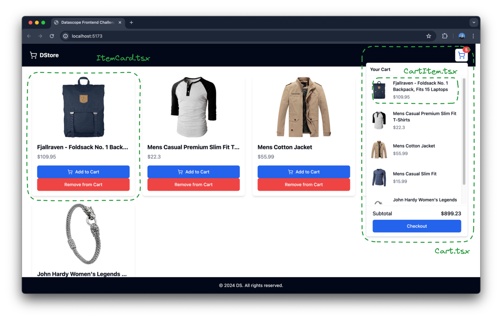

# Frontend Coding Challenge

Welcome to this cool coding challenge. The objective of this challenge is to complete the different tasks described below and make the app work as expected.

Here we have a small and simpe e-commerce app. The app consist of a simple list of store items and a shopping cart. The app is divided in the following components/files.


## How to run the app

```bash
pnpm install
pnpm run dev
```

## How app should work


## Tasks

- [ ] Implement the ability to add items to the cart by clicking the "Add to Cart" button.
- [ ] Implement the ability to remove items from the cart by clicking the "Remove from Cart" button.
- [ ] Replace the mockItems with a real API call using useEffect to fetch products from the Fake Store API (https://fakestoreapi.com/products?limit=30) and display the fetched products instead of the mock data.
- [ ] Prevent adding the same item more than once to the cart.
- [ ] Prevent adding more than 3 items to the cart.
- [ ] The "Add to Cart" button should only be displayed if the item is not on the cart. Otherwise, the "Remove from Cart" button should be displayed.
- [ ] Components `Cart.tsx` and `ItemCard.tsx` have some typecript bad practices, please fix them.
- [ ] Subtotal is not changing when you items to the cart please fix it.
